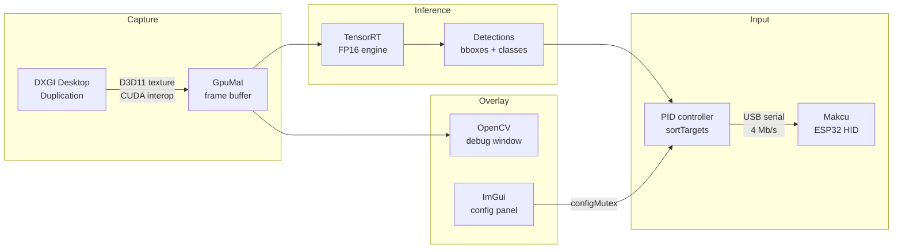

# ai_colorbot

A real-time GPU-accelerated object detection and input automation system for Windows.
Combines DXGI screen capture, NVIDIA TensorRT inference, PID-controlled mouse movement
via a Makcu (ESP32) HID emulator, and an ImGui overlay for live configuration.

## Pipeline



## Tech stack

| Component | Technology |
|-----------|-----------|
| Screen capture | DXGI Desktop Duplication API (D3D11), CUDA D3D11 interop |
| Inference | NVIDIA TensorRT 10.8, cuDNN 9.7, CUDA 12.8 |
| CV pipeline | OpenCV 4.10 with CUDA modules |
| Mouse control | PID controller + Makcu ESP32 over USB serial |
| Overlay | Win32 layered window, OpenGL 2, Dear ImGui |
| Config | SimpleIni (INI format, live GUI save) |
| Build | CMake 3.24+, MSVC v143, C++17 |

## Requirements

- Windows 10 (build 18362+)
- NVIDIA GPU with CUDA compute capability ≥ 7.5
- CUDA Toolkit 12.8
- TensorRT 10.8
- cuDNN 9.7
- OpenCV 4.10 (with CUDA build)
- [wjwwood/serial](https://github.com/wjwwood/serial) library
- CMake 3.24+, Visual Studio 2022 (MSVC v143)

## Build

```bat
:: Clone and configure
git clone https://github.com/advitarora/ai_colorbot.git
cd ai_colorbot

:: Set environment variables for dependency resolution
set TRT_PATH=C:\path\to\TensorRT
set CUDNN_PATH=C:\path\to\cuDNN

:: Configure and build
cmake -B build -G "Visual Studio 17 2022" -A x64
cmake --build build --config Release
```

The executable is written to `build/bin/Release/ai_colorbot.exe`.

## Setup

1. Export a YOLO model to TensorRT:
   ```bat
   trtexec --onnx=models\yolo10n.onnx --saveEngine=models\yolo10n.engine --fp16
   ```

2. Copy `config/config.ini` next to the executable and adjust settings.

3. Plug in the Makcu ESP32 over USB. The application auto-detects the COM port.

4. Run `ai_colorbot.exe`. Press `\` to toggle the overlay.

## Controls

| Key / Action | Effect |
|---|---|
| `\` (backslash) | Toggle ImGui settings overlay |
| Mouse button 2 (configurable) | Aimbot hold |
| Mouse button 4 (configurable) | Triggerbot hold |
| `Esc` in debug window | Exit |

## Configuration

All settings are in `config.ini` and can be changed live via the overlay GUI.
Changes are written back to the INI automatically on each frame.

See [`docs/architecture.md`](docs/architecture.md) for the full thread model and data flow.

## License

MIT — see [LICENSE](LICENSE).
