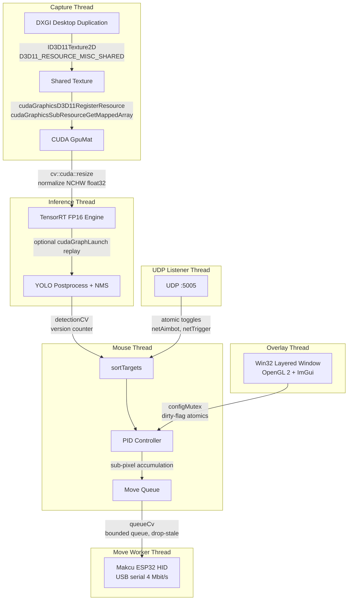

# ai-colorbot

Real-time GPU-accelerated object detection and tracking pipeline.

DXGI screen capture with zero-copy CUDA interop, TensorRT inference (YOLO v8/v10/v11/v12, FP16), PID-controlled input via serial HID device, and an ImGui overlay for live parameter tuning. ~4,200 lines of C++17 across 6 threads.

## Architecture



Six threads, one GPU pipeline. Frames never leave the GPU between capture and inference.

The capture thread acquires a `ID3D11Texture2D` via DXGI Desktop Duplication, creates a shared texture with `D3D11_RESOURCE_MISC_SHARED`, and maps it into CUDA address space with `cudaGraphicsD3D11RegisterResource`. The mapped array is copied device-to-device via `cudaMemcpy2DFromArrayAsync` into an OpenCV `GpuMat`. No staging textures, no CPU readback in the hot path. A CPU fallback path exists for cards without D3D11-CUDA interop support.

The inference thread picks up frames through a condition variable (`inferenceCV`, gated on a `frameReady` atomic). Preprocessing runs entirely on GPU: `cv::cuda::resize` to the detection resolution (160/320/640, configurable), normalize to [0,1], split into NCHW channel layout, then `cudaMemcpyAsync` into the TensorRT input binding. Postprocessing decodes boxes on CPU with per-version parsers for YOLO10 (pre-decoded `[cx,cy,x2,y2,conf,class]`) and YOLO8/9/11/12 (transposed `[4+numClasses, numAnchors]` with `cv::minMaxLoc` for class selection). NMS is IoU-based with configurable thresholds.

Detection results pass to the mouse thread via a version counter and `detectionCV`. The PID controller runs per-axis (`kp=0.50`, `ki=0.000`, `kd=0.0000` defaults) with time-delta clamped to a minimum of `(1000/captureFps) * 1e-3` seconds. Output is scaled to physical pixels through an empirically fitted sensitivity model: `sensFactor = 1.07437623 * pow(sensitivity, -0.9936827126)`, then normalized by `dpiScale = 800.0 / dpi`. Fractional remainders carry across frames (`remainder_x`, `remainder_y`), so corrections smaller than 1px/frame still produce smooth motion over time. After 10 consecutive frames with no detections, PID state resets (integral, derivative, remainders).

Move commands are enqueued to a bounded queue drained by a separate worker thread. If the queue fills (serial write stall at 4 Mbit/s), stale moves are dropped rather than blocking the PID loop. The worker thread waits on `queueCv` and sends each move to the Makcu ESP32 over USB serial.

The overlay is a Win32 layered window (`WS_EX_LAYERED | WS_EX_TOPMOST`) with black color-key transparency, rendered via OpenGL 2 and Dear ImGui. Four tabs (Aim, Capture, AI, Color) expose 30+ parameters with live dirty-tracking: changed values propagate through `configMutex`, trigger thread update callbacks, and write back to `config.ini` automatically. Toggle with backslash, 200ms debounce.

An optional color filter runs per-detection: the bounding box ROI is converted BGR to HSV, masked with `cv::inRange`, and validated by contour area. Headshots nested inside body boxes skip color filtering.

## Tech Stack

| Layer | Technology | Version |
|---|---|---|
| Screen capture | DXGI Desktop Duplication, CUDA D3D11 interop | Win10 18362+ |
| Inference | TensorRT (FP16/FP8), cuDNN, CUDA | TRT 10.8, cuDNN 9.7, CUDA 12.8 |
| CV pipeline | OpenCV with CUDA modules | 4.10 |
| Input control | PID controller, Makcu ESP32 over USB serial | 4 Mbit/s |
| Overlay | Win32 layered window, OpenGL 2, Dear ImGui | - |
| Config | SimpleIni (INI format, live GUI save) | v4.22 |
| Build | CMake, MSVC v143, C++17 | CMake 3.24+ |

## Build

```bat
git clone https://github.com/advitrocks9/ai-colorbot.git
cd ai-colorbot

set TRT_PATH=C:\path\to\TensorRT
set CUDNN_PATH=C:\path\to\cuDNN

cmake -B build -G "Visual Studio 17 2022" -A x64
cmake --build build --config Release
```

The executable lands in `build/bin/Release/ai_colorbot.exe`.

### Prerequisites

- Windows 10 (build 18362+), NVIDIA GPU with compute capability 7.5+
- CUDA Toolkit 12.8, TensorRT 10.8, cuDNN 9.7
- OpenCV 4.10 built with CUDA modules
- [wjwwood/serial](https://github.com/wjwwood/serial) (see CMakeLists.txt for setup)
- Visual Studio 2022 (MSVC v143)

## Configuration

All settings live in `config/config.ini` and can be changed at runtime through the ImGui overlay. Changes write back to the INI automatically.

To set up a model, export a YOLO checkpoint to TensorRT:

```bat
trtexec --onnx=models\yolov10n.onnx --saveEngine=models\yolov10n.engine --fp16
```

Or drop an `.onnx` file into `models/`. The engine will be built automatically on first run (takes a few minutes). Dynamic shape profiles are configured for 160x160, 320x320, and 640x640 input resolutions.

The Makcu ESP32 is auto-detected on its COM port. Press `\` to toggle the overlay.

## Key Engineering Decisions

**Zero-copy GPU pipeline.** The D3D11 texture from DXGI never touches system memory. `cuGraphicsD3D11RegisterResource` maps it into CUDA address space, and `cudaMemcpy2DFromArrayAsync` copies device-to-device into an OpenCV `GpuMat`. The entire path from screen capture through TensorRT inference stays on GPU. A CPU staging fallback (`D3D11_USAGE_STAGING`) exists but is not used in the normal path.

**CUDA graph capture for inference.** After the first forward pass, the TensorRT `enqueueV3` call and output memcpys are recorded into a CUDA graph via `cudaStreamBeginCapture` / `cudaStreamEndCapture`. Subsequent frames replay with `cudaGraphLaunch`, cutting per-frame kernel launch overhead and driver scheduling cost. Disabled by default (`use_cuda_graph=false`) since it requires fixed input dimensions.

**PID controller with sub-pixel accumulation.** The discrete PID loop computes in detection-space coordinates, then maps to physical pixels through a power-law sensitivity model fitted against real DPI/sensitivity data. Fractional pixel remainders accumulate across frames: a 0.3px/frame correction becomes a 1px move every ~3 frames instead of rounding to zero. PID state auto-resets after 10 frames of no detections to prevent integral windup on target loss.

**Decoupled move queue.** PID computation and serial I/O run on separate threads connected by a bounded, drop-oldest queue. If USB serial stalls, the PID thread keeps running at full rate. Stale moves are discarded rather than queued, so the control loop always acts on the most recent detection.

## License

MIT. See [LICENSE](LICENSE).
